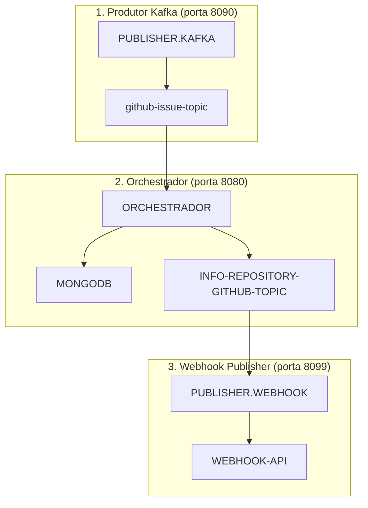

# PUBLISHER.KAFKA - Produtor Kafka

## Descrição

Este microsserviço é o **ponto de entrada** no fluxo de processamento da aplicação. É responsável por receber dados de usuários e repositórios do GitHub via API REST e publicá-los no tópico Kafka para processamento pelos outros microsserviços.

**Parte 1 do fluxo integrado de 3 microsserviços:**
1. **Producer Kafka (este)** - Recebe solicitações e publica no Kafka
2. [Orchestrador](../swap-orchestrador/README.md) - Consome mensagens, processa e persiste no MongoDB
3. [Webhook Publisher](../swap-webhook-publishing/README.md) - Publica informações via webhook

## Tecnologias Utilizadas

- Java 17
- Spring Boot 3.3.4
- Apache Kafka
- Apache Avro
- Spring Actuator
- Maven

## Requisitos

### Desenvolvimento
- Java 17 ou superior
- Maven 3.6 ou superior
- IDE compatível com Spring Boot (IntelliJ IDEA, Eclipse, VS Code)

### Testes e Execução
- Docker e Docker Compose (para infraestrutura)

## Como Executar

### 1. Preparando o Ambiente

Para executar toda a aplicação integrada, é recomendado usar o Docker Compose da raiz do projeto:

```bash
# Na raiz do projeto
docker-compose up -d
```

Se preferir executar apenas o ambiente de infraestrutura:

```bash
# Kafka, Schema Registry e MongoDB
cd ../swap-orchestrador/docker
docker-compose up -d
```

### 2. Ordem de Execução dos Microsserviços

Para garantir o funcionamento correto, inicie os serviços na seguinte ordem:

1. Infraestrutura (Kafka, Schema Registry, MongoDB)
2. **Producer Kafka (este serviço)** - porta 8090
3. [Orchestrador](../swap-orchestrador/README.md) - porta 8080
4. [Webhook Publisher](../swap-webhook-publishing/README.md) - porta 8099

### 3. Executando Este Serviço

#### Utilizando Maven
```bash
# Compilar o projeto
mvn clean package

# Executar a aplicação
mvn spring-boot:run
```

#### Utilizando JAR
```bash
# Após compilar o projeto
java -jar target/producer-0.0.1-SNAPSHOT.jar
```

#### Utilizando Docker
```bash
# Na raiz deste projeto
docker build -t publisher-kafka .
docker run -p 8090:8090 publisher-kafka
```

### 4. Verificando o Status

O serviço estará disponível em http://localhost:8090
Endpoints de monitoramento (Actuator): http://localhost:8090/actuator/health

## Como Testar o Fluxo Completo

1. Inicie os três serviços na ordem correta
2. Use o endpoint abaixo para publicar uma mensagem
3. Verifique o processamento no Orchestrador via logs
4. Observe o resultado final no endpoint webhook configurado

## Endpoints da API

### Publicar Mensagem
- **URL**: `/publisher-topic/add-msg`
- **Método**: POST
- **Corpo da Requisição**:
```json
{
  "topicName": "github-issue-topic",
  "user": "nome-usuario-github",
  "repository": "nome-repositorio-github"
}
```
- **Resposta de Sucesso**: "Mensagem publicada com sucesso!"

## Arquitetura da Solução Completa



## Configurações

As principais configurações da aplicação podem ser ajustadas no arquivo `application.properties` ou via variáveis de ambiente no Docker:

```properties
# Porta do servidor
server.port=8090

# Configurações do Kafka
kafka.bootstrap-servers=localhost:19092
kafka.schema-registry-url=http://localhost:8081

# Configurações de tópicos
kafka.topic.github.name=github-issue-topic
kafka.topic.github.partitions=3
kafka.topic.github.replicas=1
```

## Links para os Outros Microsserviços

Este serviço faz parte de uma solução composta por três microsserviços:

1. **Publisher Kafka (este)** - Ponto de entrada que recebe requisições REST e publica no Kafka
2. [Orchestrador](../swap-orchestrador/README.md) - Middleware que processa dados, persiste no MongoDB e publica em outro tópico
3. [Webhook Publisher](../swap-webhook-publishing/README.md) - Serviço final que consome do Kafka e publica via webhook

## Troubleshooting

Se encontrar problemas:

1. Verifique se o Kafka está acessível na porta configurada
2. Confirme se o Schema Registry está funcionando
3. Confira os logs de cada aplicação para identificar erros
4. Certifique-se de que os tópicos Kafka foram criados corretamente

## Desenvolvimento

### Estrutura do Projeto
- `src/main/java/swap/producer/` - Código fonte principal
  - `config/` - Configurações do Kafka e da aplicação
  - `controller/` - Controladores REST
  - `kafka/` - Classes relacionadas ao Kafka
  - `service/` - Serviços da aplicação
  - `mapper/` - Mapeadores de objetos
- `src/main/resources/` - Recursos da aplicação
  - `avro/` - Esquemas Avro para serialização

### Como Contribuir
1. Faça um fork do repositório
2. Crie uma branch para sua feature (`git checkout -b feature/nova-feature`)
3. Faça commit das suas mudanças (`git commit -m 'Adiciona nova feature'`)
4. Faça push para a branch (`git push origin feature/nova-feature`)
5. Abra um Pull Request

## Licença

[Incluir informações de licença]


