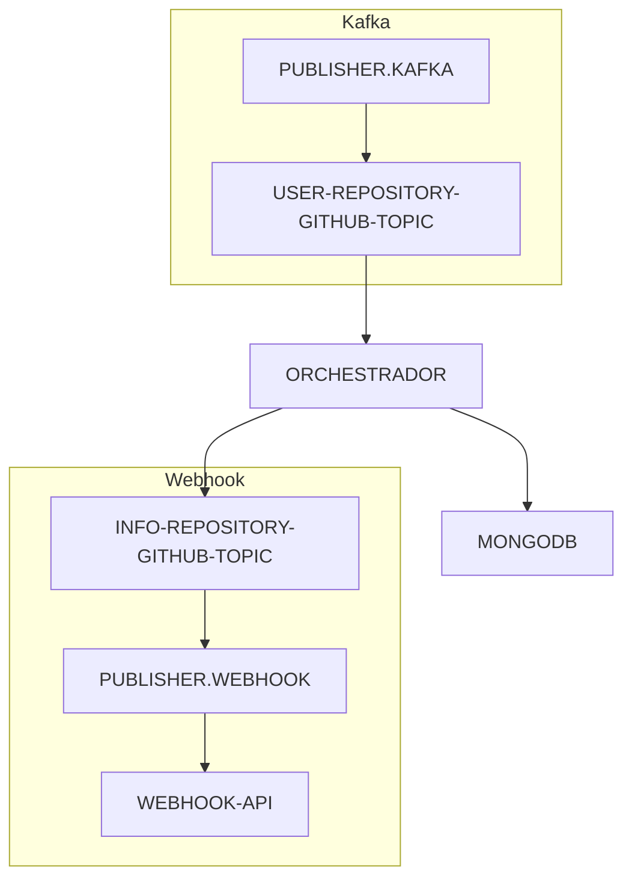

# PUBLISHER.KAFKA

## Descrição

API para publicação e consulta de informações de issues do GitHub. Este serviço é responsável por receber dados de usuários e repositórios do GitHub e publicá-los em tópicos Kafka para processamento por outros sistemas.

## Tecnologias Utilizadas

- Java 17
- Spring Boot 3.3.4
- Apache Kafka
- Apache Avro
- Spring Actuator
- Maven

## Requisitos

### Desenvolvimento
- Java 17 ou superior
- Maven 3.6 ou superior
- IDE compatível com Spring Boot (IntelliJ IDEA, Eclipse, VS Code)

### Testes e Execução
- Docker e Docker Compose (para Kafka, Zookeeper e Schema Registry)

## Como Executar

### 1. Preparando o Ambiente

Certifique-se de ter o ambiente Kafka configurado. Você pode usar o orchestrador para isso:

```bash
# Clone o repositório do orchestrador
git clone https://github.com/flpfraga/swap-orchestrador.git

# Inicie os containers Docker
cd swap-orchestrador
docker-compose up -d
```

### 2. Executando a Aplicação

#### Utilizando Maven
```bash
# Compilar o projeto
mvn clean package

# Executar a aplicação
mvn spring-boot:run
```

#### Utilizando JAR
```bash
# Após compilar o projeto
java -jar target/producer-0.0.1-SNAPSHOT.jar
```

### 3. Verificando o Status

O serviço estará disponível em http://localhost:8090
Endpoints de monitoramento (Actuator): http://localhost:8090/actuator

## Endpoints da API

### Publicar Mensagem
- **URL**: `/publisher-topic/add-msg`
- **Método**: POST
- **Corpo da Requisição**:
```json
{
  "topicName": "nome-do-topico",
  "user": "nome-usuario-github",
  "repository": "nome-repositorio-github"
}
```
- **Resposta de Sucesso**: "Mensagem publicada com sucesso!"

## Arquitetura da Solução



## Configurações

As principais configurações da aplicação podem ser ajustadas no arquivo `application.properties`:

```properties
# Porta do servidor
server.port=8090

# Configurações do Kafka
kafka.bootstrap-servers=localhost:19092
kafka.schema-registry-url=http://localhost:8081

# Configurações de tópicos
kafka.topic.github.name=github-issue-topic
kafka.topic.github.partitions=3
kafka.topic.github.replicas=1
```

## Integração com Outros Serviços

Este serviço faz parte de um ecossistema maior e integra-se com:

1. [Orchestrador](https://github.com/flpfraga/swap-orchestrador) - Serviço que consome os dados publicados e orquestra o fluxo de processamento
2. [Publisher Webhook](https://github.com/flpfraga/swap-webhook-publishing) - Serviço que consome dados do tópico INFO-REPOSITORY-GITHUB-TOPIC e publica via Webhooks

## Desenvolvimento

### Estrutura do Projeto
- `src/main/java/swap/producer/` - Código fonte principal
  - `config/` - Configurações do Kafka e da aplicação
  - `controller/` - Controladores REST
  - `kafka/` - Classes relacionadas ao Kafka
  - `service/` - Serviços da aplicação
  - `mapper/` - Mapeadores de objetos
- `src/main/resources/` - Recursos da aplicação
  - `avro/` - Esquemas Avro para serialização

### Como Contribuir
1. Faça um fork do repositório
2. Crie uma branch para sua feature (`git checkout -b feature/nova-feature`)
3. Faça commit das suas mudanças (`git commit -m 'Adiciona nova feature'`)
4. Faça push para a branch (`git push origin feature/nova-feature`)
5. Abra um Pull Request

## Licença

[Incluir informações de licença]


